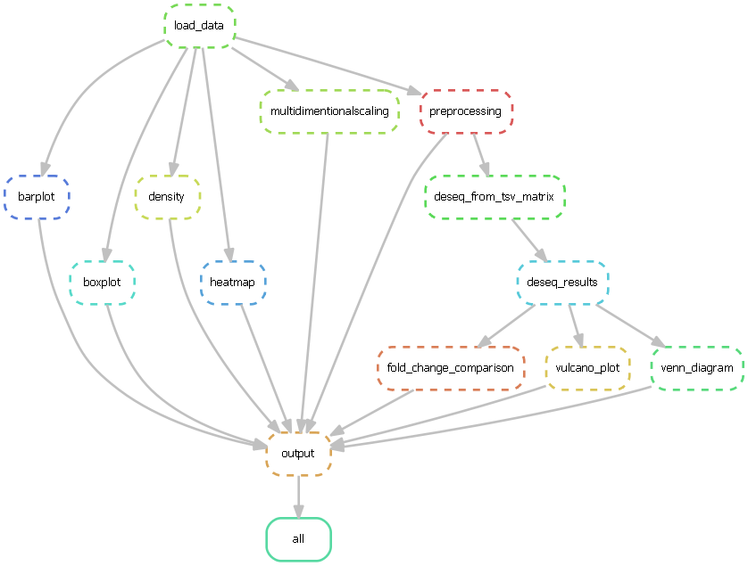

# Early brain development disrupted by 16p11.2 copy number variants in autism
Insertions or deletions of the 16p11.2 region is often associated with neurodevelopmental disorders. Deletion of this region often leads to the autism spectrum disorder. In this research, the authors wanted to know if brain organoids faithfully recapitulate the fetal development at the transcriptional level. They did this by looking for correlations between these genes and different groups. (insertion, deletion and a controle group). By comparing these 3 groups with eachother it's easy to find correlations or patterns. The result mostly contains figures of compared data concluding that brain organoids do recapitulate fetal development at the transcriptional level. This was already concluded in a previous study.
# The results
The goal of this snakemake project is to make this more efficent. The final output is a pdf file that consists of every graph made within this project.
The final result of this project will be shown at the bottom of this readme!

## Workflow

## Dependencies
- R = 4.2
- Python3
- Snakemake
#### R packages
- r-pander
- r-scales
- r-pheatmap
- r-'PoiClaClu'
- r-readr
- r-jsonlite
- r-ashr
- r-gplots
- r-venndiagram
- r-ggvenn
- r-BiocManager

### Biocmanager packages
- GEOquery
- affy
- DESeq2
- EnhancedVolcano
- tximport

#### python packages
- Pillow
- shell: python3 -m pip install --upgrade Pillow

### Create workflow visualisation
- SHELL: snakemake --dag | Out-File -FilePath workflow.dot -Encoding ascii
- SHELL: dot -Tpng workflow.dot -o workflow.png

